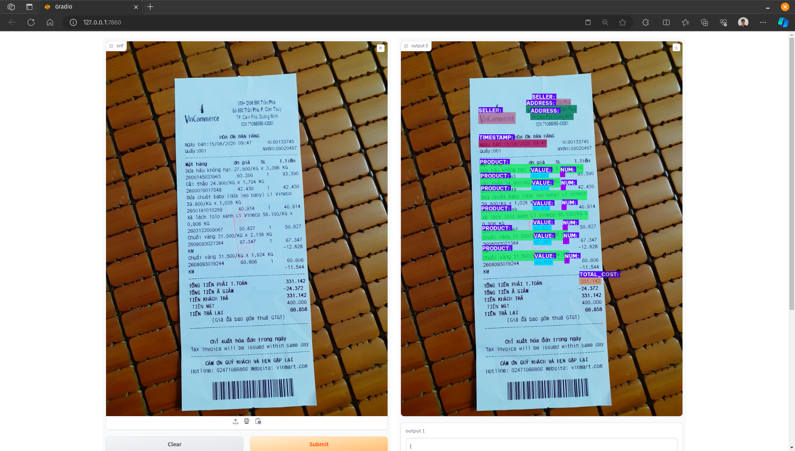

# OCR-invoice

## Introduction
OCR-invoice đây là đồ án tốt nghiệp của tôi, ứng dụng những gì đã học và tìm hiểu được để xây dựng một dự án về OCR cho việc nhận dạng và trích xuất thông tin hóa đơn bán hàng từ cửa hàng tiện lợi sau đó lưu lại dưới dạng Json.

## Features
- Nhận dạng văn bản tiếng việt.
- Trích xuất thông tin từ hình ảnh hóa đơn.
- Lưu trữ thông tin dưới dạng Excel

## Installation:
### Requiremets:
- Python3.9
- Pytorch == 1.13.1
- GCC >= 4.9
- CUDA == 11.6

```
# Create conda env
conda create -n invoice_env python=3.9
conda activate invoice_env

# Clone this repo
git clone https://github.com/HoVDuc/OCR-invoice.git
cd OCR-invoice

# Install the necessary libraries
pip install -r requirements.txt

# Install pytorch with CUDA11.6
pip3 install torch torchvision --index-url https://download.pytorch.org/whl/cu116

# Install paddlepaddle and paddlenlp
python -m pip install paddlepaddle-gpu==2.5.2 -i https://pypi.tuna.tsinghua.edu.cn/simple paddlenlp==2.5.2
```

### Download weights:

```
# download weight
wget https://github.com/HoVDuc/OCR-invoice/releases/download/v0.2/weights.tar.xz

# unzip 
tar -xf weights.tar.xz -C ./src/
```

## Inference
### Paramater
- `config`: đường dẫn file config 
- `checkpoint`: đường dẫn weight
- `use_gpu`: sử dụng GPU (mặc định `False`)
- `share_link`: chia sẻ liên kết web demo (mặc định `False`)
- `det_limit_type`: `max` hoặc `min` (mặc định `max`)

```
# Run program use GPU
python infer.py --use_gpu --det_limit_type='min'
```

## Result


```
{
 "SELLER": "VinCommerce",
 "ADDRESS": "TP. Cảm Phà, Quảng Ninh",
 "TIMESTAMP": "ngày bán: 15/08/2020 09:47",
 "PRODUCTS": [
  {
   "PRODUCT": "dưa hấu không hạt 27.500/KG x 3,396 KG",
   "NUM": "1",
   "VALUE": "93.390"
  },
  {
   "PRODUCT": "cải thảo 24.900/KG x 1,704 KG",
   "NUM": "1",
   "VALUE": "42.430"
  },
  {
   "PRODUCT": "chuột baby (dưa leo baby) L1 Vineco",
   "NUM": "1",
   "VALUE": "40.914"
  },
  {
   "PRODUCT": "Xà lách 1010 xanh Lị Vineco 56.100/KG x",
   "NUM": "1",
   "VALUE": "50.827"
  },
  {
   "PRODUCT": "Chuổi vàng 31.500/KG x 2,138 KG",
   "NUM": "1",
   "VALUE": "67.347"
  },
  {
   "PRODUCT": "Chuối vàng 31.500/KG x 1,924 KG",
   "NUM": "1",
   "VALUE": "60.606"
  }
 ],
 "TOTAL_COST": "331.142"
}
```